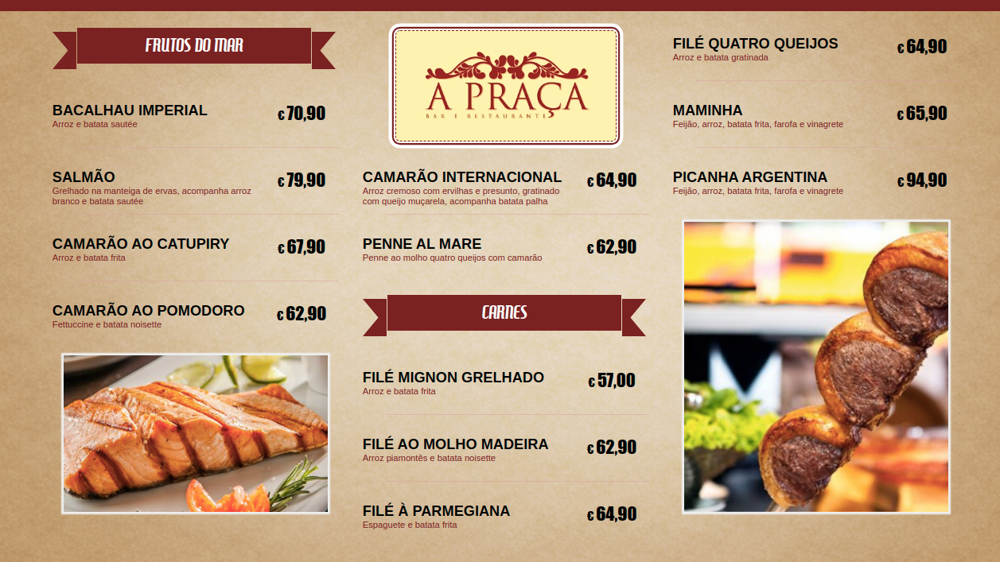
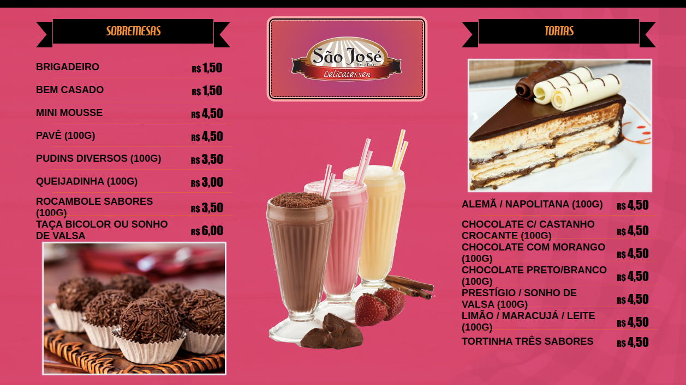
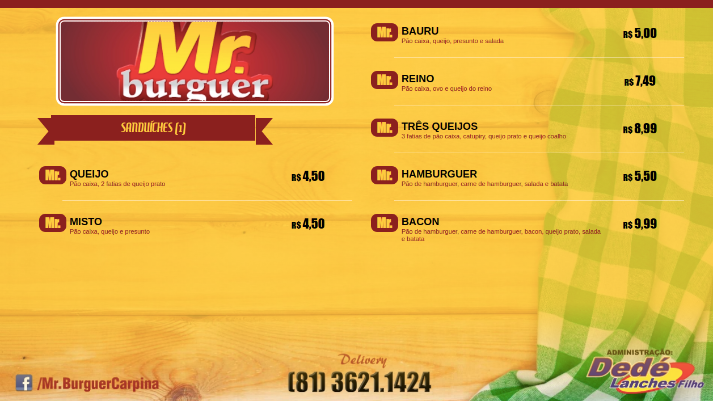
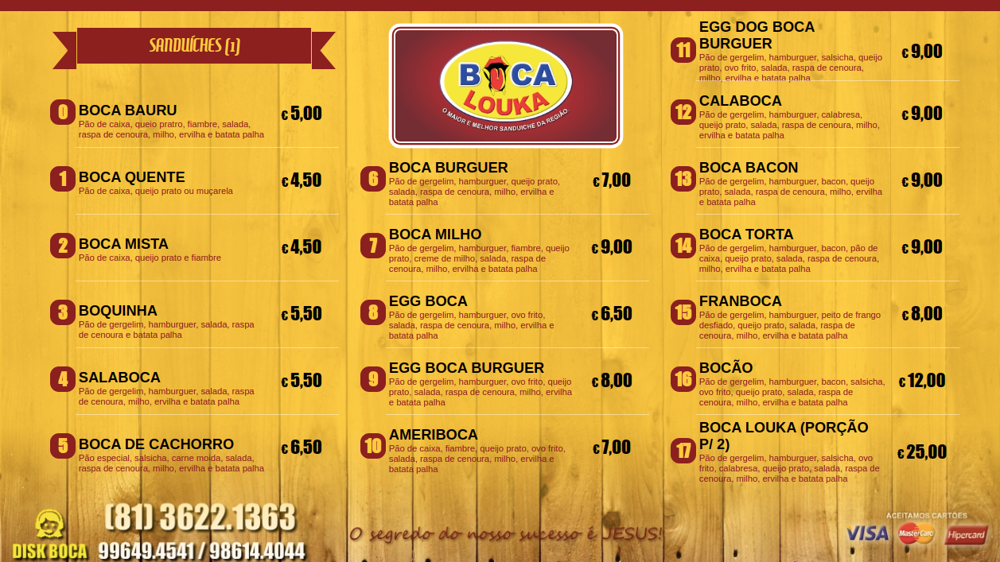

# DSPLAY - Menu Board

This is a HTML-based template for [DSPLAY](https://dsplay.tv).

## Basics

> This project was bootstrapped with [DSPLAY - React Template Boilerplate](https://github.com/dsplay/template-boilerplate-react).

## Usage

This template has the following features:
- 4 layout modes:
  - 3 columns horizontal 
  - 2 columns horizontal
  - 2 columns vertical
  - 1 column vertical
- Auto distribute items
- Support for special commands:
  - column break (`/cb`)
  - page break (`/pb`)
  - empty line (`/n`)
  - feature image (`/fi`)
  - layout image (`/li`)






### Configuration

This template has many configuration variables as the following table shows:

| Variable              | Type    | Required | Default   | Description                                                                                                                           |
|-----------------------|---------|----------|-----------|---------------------------------------------------------------------------------------------------------------------------------------|
| `logo`                | image   | Yes      |           | Brand logo                                                                                                                            |
| `screenSize`          | string  | No       | `large`   | Determines the number of columns. Possible values: `large` or `small`.                                                                |
| `backgroundImage`     | image   | No       |           | The background image                                                                                                                  |
| `color1`              | string  | No       | `darkred` | Template Color 1                                                                                                                      |
| `color2`              | string  | No       | `#000`    | Template Color 2                                                                                                                      |
| `color3`              | string  | No       | `#FFF`    | Template Color 3                                                                                                                      |
| `color4`              | string  | No       | `#FFCA08` | Template Color 4                                                                                                                      |
| `loopCount`           | string  | No       | 1         | Determines how many times the content should be presented during media duration                                                       |
| `currencyMaxCols`     | string  | No       |           | For multi-price items, determines that currency symbol should be displayed up to this number of price-columns.                        |
| `topBarColor`         | image   | No       | `color1`  |                                                                                                                                       |
| `backgroundColor`     | color   | No       | `color4`  |                                                                                                                                       |
| `backgroundOpacity`   | string  | No       | `.8`      |                                                                                                                                       |
| `bgOpacityThreshold`  | float   | No       | `75%`     |                                                                                                                                       |
| `categoryColor`       | color   | No       | `color4`  |                                                                                                                                       |
| `categoryBgColor`     | color   | No       | `color1`  |                                                                                                                                       |
| `numberColor`         | color   | No       | `color4`  |                                                                                                                                       |
| `numberBgColor`       | color   | No       | `color1`  |                                                                                                                                       |
| `titleColor`          | color   | No       | `color2`  |                                                                                                                                       |
| `priceColor`          | color   | No       | `color2`  |                                                                                                                                       |
| `descColor`           | color   | No       | `color1`  |                                                                                                                                       |
| `separatorColor`      | color   | No       | `color3`  |                                                                                                                                       |
| `brandBoxBorderColor1`| color   | No       | `color1`  |                                                                                                                                       |
| `brandBoxBorderColor2`| color   | No       | `color3`  |                                                                                                                                       |
| `priceTitlesColor`    | color   | No       | `color1`  |                                                                                                                                       |
| `footer`              | boolean | No       | `true`    | Determine if footer area must be preserved (ex: for showing additional info present on background image)                              |
| `image1...image15`    | image   | No       |           |                                                                                                                                       |


## Customizing

### Getting started

```
git clone https://github.com/dsplay/template-horizontal-info-bar.git my-awesome-template
cd my-awesome-template
rm -rf .git
npm i
npm start
```

## Packing (release build)

To create a release build of the template, ready to be uploaded to DSPLAY, just run:

```
npm run zip
```

It will generate a `template.zip` file ready to be deployed to [DSPLAY Web Manager](https://manager.dsplay.tv/template/create)

## More

The see more about DSPLAY HTML Templates, visit: https://developers.dsplay.tv/docs/html-templates