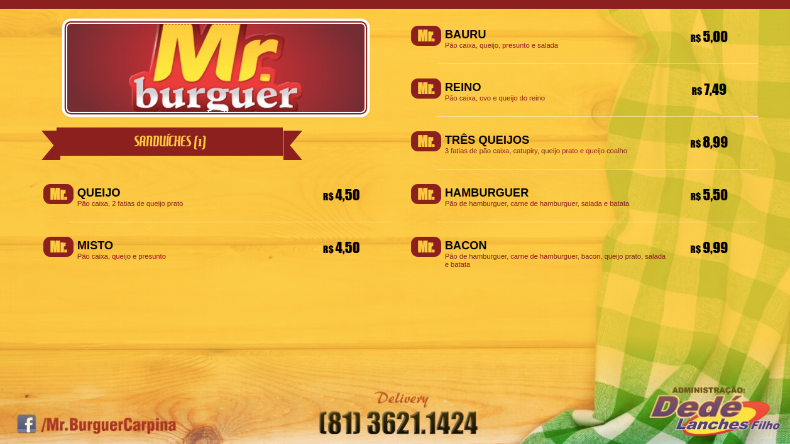
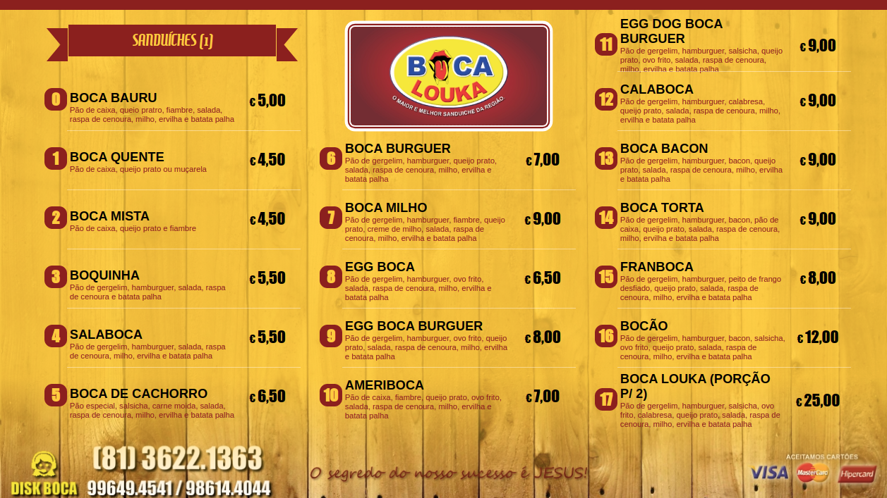

# DSPLAY - Menu Board

A [React](https://reactjs.org/) [HTML-based template](https://developers.dsplay.tv/docs/html-templates) for the [DSPLAY - Digital Signage](https://dsplay.tv/) platform — a JSON-driven restaurant/store menu board that auto-lays-out categories and items across up to 3 columns and paginates when content overflows.

> Built with [Vite](https://vitejs.dev/), requires Node.js 22.22.2+, 24.15.0+, or 26+ (see `.nvmrc`).

## Features

- 4 layout modes, chosen automatically from screen orientation and the `screenSize` variable: 3 columns (horizontal, large), 2 columns (horizontal small, or vertical large), 1 column (vertical small).
- Automatically distributes menu items/categories across columns and pages, rotating pages on an interval.
- In-content commands inside an item's `num` field: `/cb` (column break), `/pb` (page break), `/n` (blank line), `/fi(n[,size])` (featured image, bordered), `/li(n[,size])` (layout image, undecorated).





## Template variables

| Key                     | Type    | Default   | Description                                                                                                            |
|-------------------------|---------|-----------|--------------------------------------------------------------------------------------------------------------------------|
| `logo`                  | string  |           | Brand logo, shown in the central column's brand box.                                                                   |
| `screenSize`            | string  | `large`   | `large` or `small` — determines column count (see Features above).                                                     |
| `backgroundImage`       | string  |           | Background image.                                                                                                       |
| `showPartials`          | boolean | `true`    | When a category repeats across a column/page break, show it again with a "(2)"-style usage-count suffix.              |
| `footer`                | boolean | `true`    | Reserve space at the bottom of each column (e.g. for footer info baked into the background image).                     |
| `loopCount`              | int     | `1`       | How many times the full set of pages repeats during the media's total display duration.                                |
| `currencySymbol`        | string  |           | Currency symbol shown before each price.                                                                                |
| `currencyMaxCols`       | string  |           | For multi-price items, only show the currency symbol up to this many price columns.                                    |
| `color1`                | string  | `darkred` | Base color 1 — default for `topBarColor`/`categoryBgColor`/`numberBgColor`/`descColor`/`brandBoxBorderColor1`/`priceTitlesColor`. |
| `color2`                | string  | `#000`    | Base color 2 — default for `titleColor`/`priceColor`.                                                                  |
| `color3`                | string  | `#FFF`    | Base color 3 — default for `separatorColor`/`brandBoxBorderColor2`.                                                    |
| `color4`                | string  | `#FFCA08` | Base color 4 — default for `backgroundColor`/`categoryColor`/`numberColor`.                                            |
| `topBarColor`           | string  | `color1`  | Color of the top bar.                                                                                                   |
| `categoryBgColor`       | string  | `color1`  | Category label background color.                                                                                       |
| `numberBgColor`         | string  | `color1`  | Item number background color.                                                                                          |
| `descColor`             | string  | `color1`  | Item description text color.                                                                                            |
| `brandBoxBorderColor1`  | string  | `color1`  | Brand box border/shadow color 1.                                                                                        |
| `priceTitlesColor`      | string  | `color1`  | Price-column header text color.                                                                                        |
| `titleColor`            | string  | `color2`  | Item title text color.                                                                                                  |
| `priceColor`            | string  | `color2`  | Item price text color.                                                                                                  |
| `separatorColor`        | string  | `color3`  | Color of the `<hr>` separator between items.                                                                            |
| `brandBoxBorderColor2`  | string  | `color3`  | Brand box border/shadow color 2.                                                                                        |
| `backgroundColor`       | string  | `color4`  | Base color the page's background gradient fades from.                                                                  |
| `categoryColor`         | string  | `color4`  | Category label text color.                                                                                              |
| `numberColor`           | string  | `color4`  | Item number text color.                                                                                                 |
| `backgroundOpacity`     | float   | `0.8`     | Opacity of the background gradient's starting color.                                                                    |
| `bgOpacityThreshold`    | string  | `75%`     | Gradient stop where the background starts fading to transparent.                                                        |
| `image1` ... `image15`  | string  |           | Pool of images referenced by `/fi(n)`/`/li(n)` commands in menu item `num` fields (`image1` = `/fi(1)`, etc). |

> Remember to also register these as Template Vars (same name and type) when configuring this template in the DSPLAY CMS. **`logo`, `currencySymbol`, `currencyMaxCols`, and `image1`...`image15` are read as direct `template.<key>` property access rather than through `tval()`, so `@dsplay/template-manifest`'s static scanner can't auto-detect them** — double check they're registered manually in the CMS.

## Local development

```sh
npm install
npm start
```

`public/dsplay-data.js` defines `dsplay_config`/`dsplay_media`/`dsplay_template` mock globals used only when the template isn't running inside the actual DSPLAY app. `dsplay_media.result.data.categories` is where the actual menu content lives — edit it to try out different menus. The DSPLAY Player App replaces it with real content at runtime.

## Packing (release build)

```sh
npm run zip
```

This builds the template with Vite, which also generates `template-variables.json` + `template-example-data.json` (via [@dsplay/template-manifest](https://www.npmjs.com/package/@dsplay/template-manifest)'s Vite plugin) — the DSPLAY CMS reads these two files to auto-detect this template's variables and seed default preview values. It then generates `template.zip`, ready to be deployed to the [DSPLAY Web Manager](https://manager.dsplay.tv/template/create).

## Test assets

To use test assets (images, videos, etc) during development, put them in the `public/test-assets` folder and reference them in `dsplay-data.js` using their relative path. `public/test-assets` is automatically excluded from the release build.

## Maintaining dependencies

Regular npm dependencies, not vendored files:

```sh
npm outdated
npm update
```

For a version outside the declared range (typically a major bump), apply it deliberately and verify `npm start`, `npm run build`, and `npm test` still work before committing.

### Commit conventions

See [AGENTS.md](AGENTS.md).

## More

To see more about DSPLAY HTML Templates, visit: https://developers.dsplay.tv/docs/html-templates
